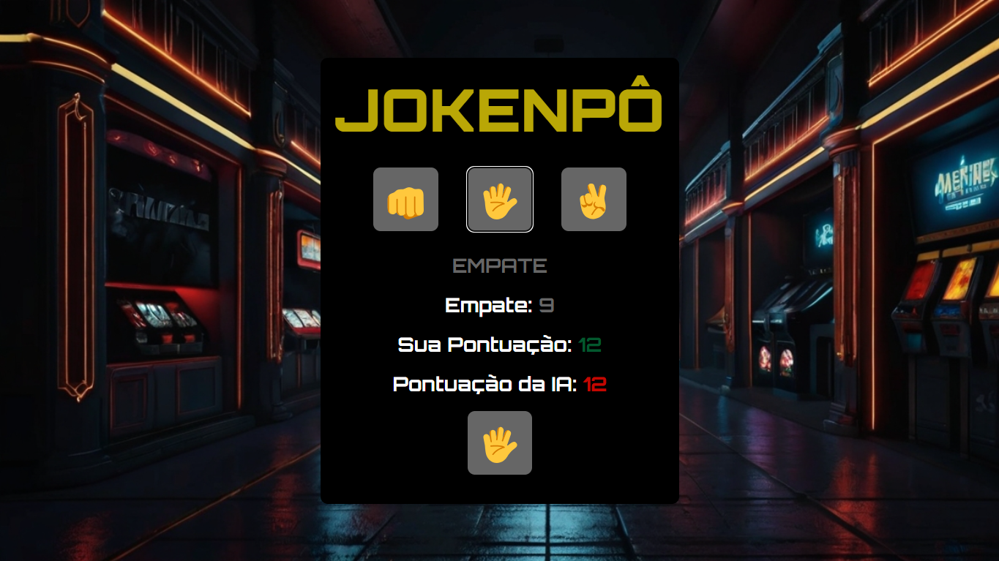
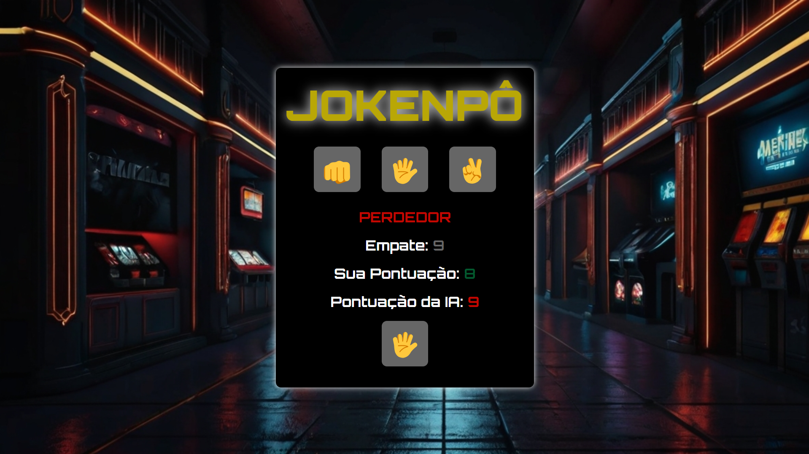

<h1 align="center">Projeto JOKENPÔ</h1>

<h2>Olá sejam bem-vindo</h2>

Projeto JOKENPÔ

É um jogo bem antigo, com origem na China, mas foi no Japão que recebeu o nome "Jokenpô" e se popularizou pelo mundo todo. Mais conhecido como Pedra, Papel e Tesoura.

<h4>Desenvolvimento:</h4>

<ul>
<li>HTML: Estrutura robusta e organizada, com foco em acessibilidade e semântica.</li>
<li>CSS: Design vibrante e convidativo, com cores doces e ilustrações encantadoras.</li>
<li>Layout responsivo: Adapta-se perfeitamente a qualquer tela, seja desktop, tablet ou smartphone.</li>
</ul>

<h4>Link:</h4>

> Deploy: https://daliosy.github.io/jokenpo

> Repoditório: https://github.com/DalioSY/jokenpo

> Linkedin: https://www.linkedin.com/in/dalio-s-yamada/

#webdesign #html #css #jokenpo
 

  <ul align="center">
    <h2 style="display: inline-block">Imagens:</h2>
  </ul>

 

